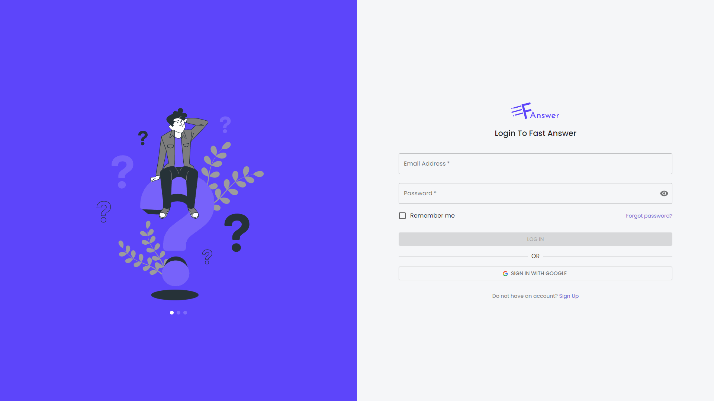

<a name="readme-top"></a>

<!-- PROJECT LOGO -->
<br />
<div align="center">
  <a href="https://github.com/Elalfy74/fast-answer">
    
  </a>

  <h3 align="center">FAST ANSWER</h3>

  <p align="center">
    A Platform similar to stack overflow where users can ask, answer and even chat with each other built with React, MUI, and Firebase
    <br />
    <br />
    <a href="">
    View Demo</a>
    ·
    <a href="https://fast-answer.vercel.app/">
    See Live</a>
  </p>
</div>

<!-- TABLE OF CONTENTS -->
<details>
  <summary>Table of Contents</summary>
  <ol>
    <li>
      <a href="#about-the-project">About The Project</a>
      <ul>
        <li><a href="#built-with">Built With</a></li>
        <li><a href="#features">Features</a>
          <ul>
            <li><a href="#authentication">Authentication</a></li>
            <li><a href="#firebase">Firebase</a></li>
            <li><a href="#App">App</a></li>
          </ul>
        </li>
      </ul>
    </li>
    <li>
      <a href="#getting-started">Getting Started</a>
      <ul>
        <li><a href="#prerequisites">Prerequisites</a></li>
        <li><a href="#installation">Installation</a></li>
      </ul>
    </li>
    <li><a href="#contact">Contact</a></li>
  </ol>
</details>

<!-- ABOUT THE PROJECT -->

## About The Project

[![Fast Answer][product-screenshot]](https://fast-answer.vercel.app/)

A Platform similar to stack overflow where users can ask, answer and even chat with each other built with React, MUI, and Firebase

<p align="right">(<a href="#readme-top">back to top</a>)</p>

### Built With


<p align="right">(<a href="#readme-top">back to top</a>)</p>

### Features

#### Authentication

The app authentication is done with Firebase Auth to be compatible with any auth provider and other Firebase features.

Example: [Login](https://fast-answer.vercel.app/auth/login)


#### Firebase

The API is built with Firebase which is a modern PASS because it's provide non-relational database and fast real-time database.

<p align="right">(<a href="#readme-top">back to top</a>)</p>

#### App

- A Platform similar to stack overflow where users can ask, answer and even chat with each other.
- Data is Pulled from popular questions on stack overflow.
- App support pagination throw infinite scroll technique.
- User can ask and answer questions whether they are logged in or not.
- Questions and answers can be typed with rich text editor.
- User can also bookmark questions.
- User can also see their profile and settings.
- User can also chat with each other in real-time.
- User can also see their upvotes and downvotes on questions and answers.
- User can change their profile picture and other settings.


<p align="right">(<a href="#readme-top">back to top</a>)</p>
<!-- GETTING STARTED -->

## Getting Started

### Prerequisites

- Node.js
- npm or yarn
- firebase

### Installation

1. Clone the repo
   ```sh
   git clone https://github.com/Elalfy74/fast-answer
   ```
2. Install NPM packages
   ```sh
   yarn
   ```
3. Rename 'env.example' to 'env'
4. Configure .env Variables
   replace default values with your own
5. Start the project
   ```sh
   yarn dev
   ```

<p align="right">(<a href="#readme-top">back to top</a>)</p>

<!-- CONTACT -->

## Contact

Mahmoud Elalfy - [@Mahmoudelalfy74](https://twitter.com/Mahmoudelalfy74) -
[@Portfolio](https://mahmoud-elalfy.vercel.app/) -
[@LinkedIn](https://www.linkedin.com/in/mahmoud-elalfy-79b894209/)

Project Link: [Fast Answer](https://github.com/Elalfy74/fast-answer)

<p align="right">(<a href="#readme-top">back to top</a>)</p>

[product-screenshot]: assets/images/screenshot.png
